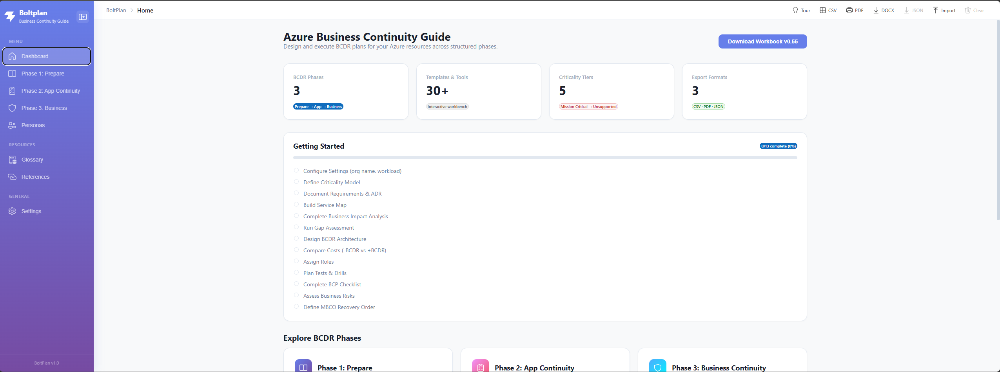
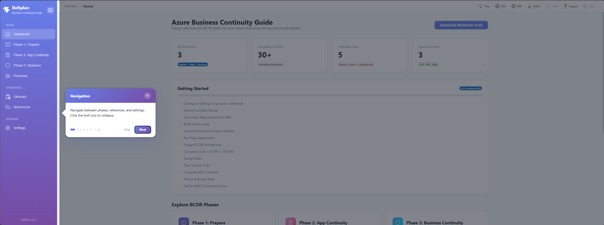
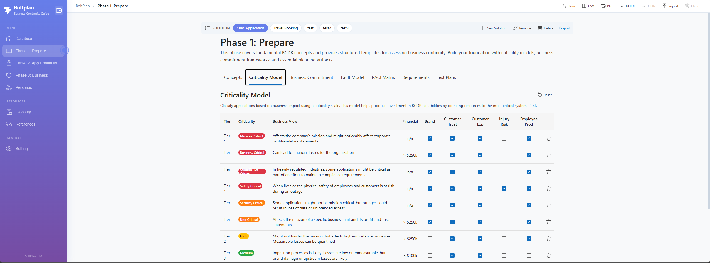
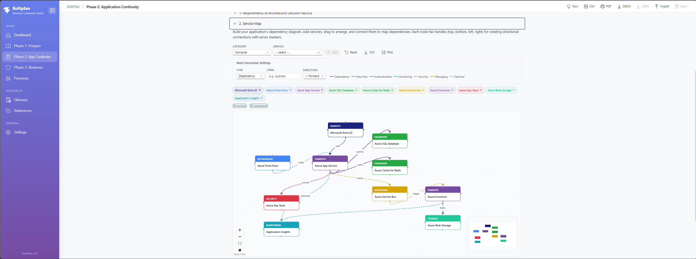
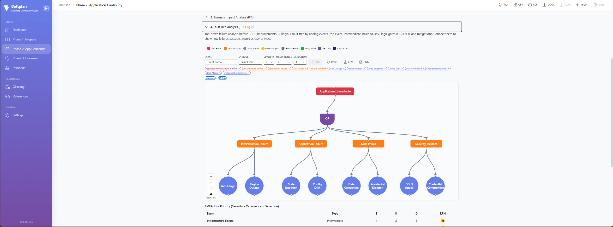
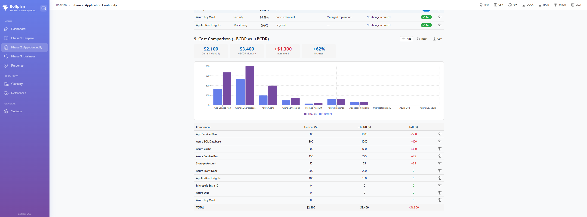
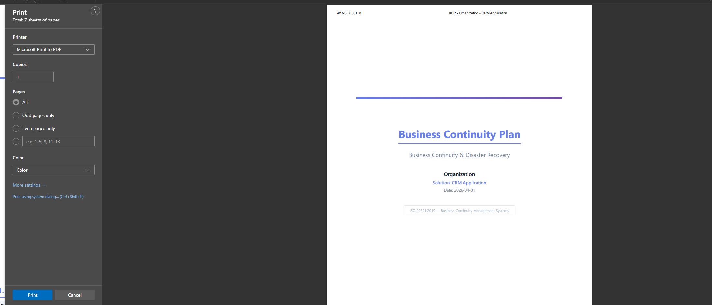
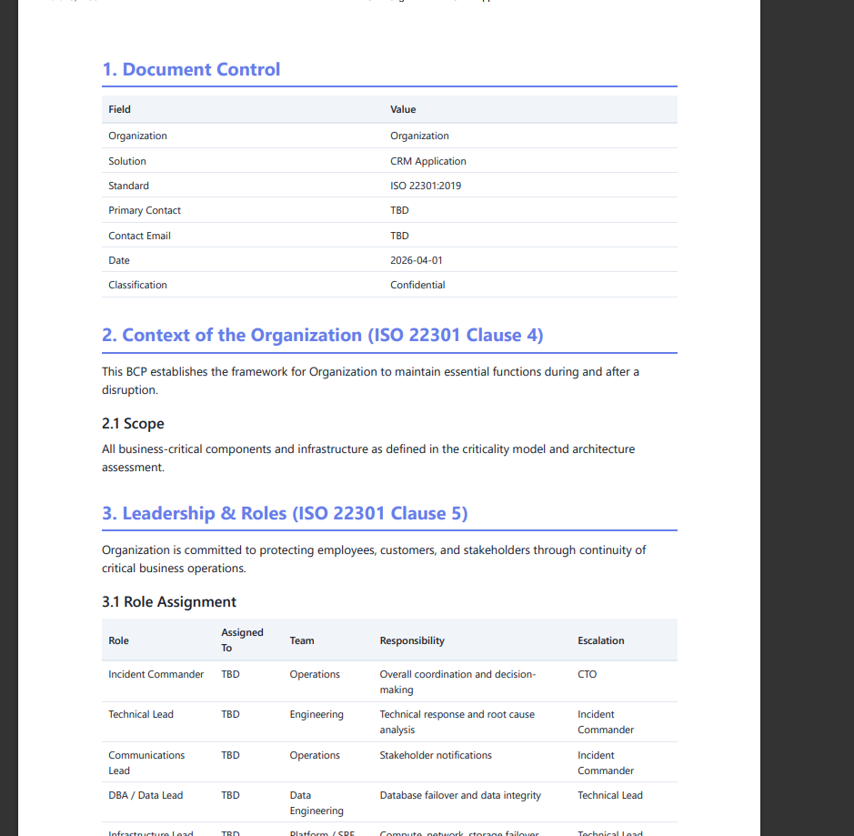

<p align="center">
  
</p>

<h1 align="center">BoltPlan</h1>
<p align="center"><em>Interactive BCDR Workbench for Azure &mdash; ISO 22301 Compliant</em></p>

<p align="center">
  
  
  
  
  
  
  
  <a href="LICENSE"></a>
  
</p>

<p align="center">
  <a href="#quick-start">Quick Start</a> &bull;
  <a href="#why-boltplan">Why BoltPlan</a> &bull;
  <a href="#features">Features</a> &bull;
  <a href="#phases">BCDR Phases</a> &bull;
  <a href="#exports">Exports</a> &bull;
  <a href="#architecture">Architecture</a> &bull;
  <a href="LICENSE">License</a>
</p>

<p align="center">
  <strong>Plan. Assess. Implement. Test.</strong> Build ISO 22301-compliant BCDR plans interactively.<br/>
  Based on the Azure Business Continuity Guide &bull; 100+ Azure services &bull; Multi-solution support &bull; PDF &amp; Word export
</p>

<p align="center">
  
</p>

<details open>
<summary><strong>Table of Contents</strong></summary>

- [Why BoltPlan?](#why-boltplan)
- [Quick Start](#quick-start)
- [Features](#features)
- [BCDR Phases](#phases)
- [Exports](#exports)
- [Architecture](#architecture)
- [Development](#development)
- [License](#license)

</details>

---

## Why BoltPlan?

Instead of filling out Excel spreadsheets across dozens of tabs, use this interactive web workbench to:

- **Build service maps** visually with drag-and-drop React Flow diagrams
- **Run fault tree analysis** with official IEC 61025 symbols and FMEA scoring
- **Calculate composite SLAs** automatically from your component chain (per Microsoft WAF)
- **Track BCDR progress** with a 13-step getting-started checklist
- **Generate ISO 22301 reports** as professional PDF or Word documents
- **Manage multiple solutions** &mdash; each with fully isolated data across all phases

> **Based on:** The [Azure Business Continuity Guide](https://github.com/Azure/BusinessContinuityGuide) Excel workbook (v0.55), reimagined as a modern interactive web application.

<p align="right">(<a href="#boltplan">back to top</a>)</p>

---

## Quick Start

```bash
git clone https://github.com/Azure/BusinessContinuityGuide.git
cd BusinessContinuityGuide/web-app
npm install
npm run dev
```

Open [http://localhost:5173](http://localhost:5173) &mdash; a guided tour starts automatically.

| Prerequisite | Version | Install |
|-------------|---------|---------|
| Node.js | 18+ | [nodejs.org](https://nodejs.org/) |
| npm | 9+ | Included with Node.js |

No backend required &mdash; all data stored in browser localStorage.

<p align="right">(<a href="#boltplan">back to top</a>)</p>

---

## Features

### Guided Tour

A 6-step branded walkthrough auto-starts for first-time visitors. Re-launch anytime from the Tour button.

<p align="center">
  
</p>

### Criticality Model &amp; Multi-Solution Support

Define criticality tiers with auto-colored badges. Switch between solutions with the chip selector &mdash; all data is isolated per solution.

<p align="center">
  
</p>

### Service Map (React Flow)

Build your architecture with 100+ Azure services across 14 categories. 7 connection types with editable labels, direction, and click-to-edit. Export as PNG or CSV.

<p align="center">
  
</p>

### Fault Tree Analysis (IEC 61025)

Official FTA symbols with FMEA risk priority scoring (Severity x Occurrence x Detection = RPN). Before/after comparison for -BCDR and +BCDR.

<p align="center">
  
</p>

### Cost Comparison &amp; Architecture Design

Bar chart comparing before/after BCDR costs. Auto-synced from Architecture Design section.

<p align="center">
  
</p>

### ISO 22301 PDF &amp; Word Export

Generate a full Business Continuity Plan &mdash; 13 sections + appendices, all populated from your workbench data.

<p align="center">
  
</p>

<p align="center">
  
</p>

<p align="right">(<a href="#boltplan">back to top</a>)</p>

---

## Phases

### Phase 1: Prepare

| Tab | Content |
|-----|---------|
| Concepts | Shared Responsibility, Design Patterns, Reliability Trade-offs |
| Criticality Model | Color-coded tiers with auto-colored badges |
| Business Commitment | 7 expandable sub-sections |
| Fault Model | Failure types with mitigation strategies |
| RACI Matrix | 29 deliverables mapped to 8 roles |
| Requirements | Categorized with filters |
| Test Plans | Types with frequency tracking |

### Phase 2: Application Continuity

| Sub-tab | Sections | Key Features |
|---------|----------|-------------|
| **Assess** (6) | Requirements, Service Map, BIA, Fault Tree, Gap Assessment, Metrics | React Flow, composite SLA, FMEA |
| **Implement** (7) | Response Plan, Architecture, Cost, Metrics, Fault Tree +BCDR, Contingency, Roles | Auto-sync, charts, reorderable steps |
| **Test** (5) | Test Summary, Drill, UAT, Communication, Maintenance | Clickable status cycling |

### Phase 3: Business Continuity

| Tab | Sections |
|-----|----------|
| Planning &amp; Risk | BCP Checklist (progress %), Risk Assessment (5x5 matrix) |
| MBCO &amp; Portfolio | Recovery Order, BIA Portfolio Summary |
| Operations | Calendar, Dashboard (auto-populated), Activity Log |
| Maintenance | Review schedule with status cycling |

<p align="right">(<a href="#boltplan">back to top</a>)</p>

---

## Exports

| Format | Content | Button |
|--------|---------|--------|
| **PDF** | Full ISO 22301 BCP (13 sections + appendices) | Toolbar: PDF |
| **Word (.docx)** | Same ISO 22301 structure as PDF | Toolbar: DOCX |
| **CSV** | All phase data | Toolbar: CSV or per-section |
| **JSON** | Full workbench backup per solution | Toolbar: JSON |
| **PNG** | Service Map and Fault Tree diagrams | Per-diagram buttons |

---

## Architecture

| Technology | Purpose |
|-----------|---------|
| React 19 + TypeScript | UI framework |
| Vite 8 | Build tool |
| FluentUI React v9 | Component library |
| React Flow 11 | Service Map &amp; Fault Tree |
| Recharts 3 | Charts |
| React Joyride 3 | Guided tour |
| docx + file-saver | Word export |
| html-to-image | PNG export |
| localStorage | Per-solution persistence |

<details>
<summary><strong>Project Structure</strong></summary>

```
web-app/src/
├── App.tsx                     # Collapsible sidebar, toolbar
├── components/
│   ├── Home.tsx                # Dashboard + progress card
│   ├── Phase1Prepare.tsx       # Tabbed: Concepts → Test Plans
│   ├── Phase2*.tsx             # Assess, Implement, Test
│   ├── phase2/
│   │   ├── ServiceMap.tsx      # React Flow + Azure catalog
│   │   └── FaultTree.tsx       # IEC 61025 + FMEA
│   ├── Phase3*.tsx             # Planning → Maintenance
│   ├── AppSelector.tsx         # Multi-solution switcher
│   ├── GuidedTour.tsx          # Branded walkthrough
│   └── HelpIcon.tsx            # "?" contextual help
├── context/
│   ├── AppContext.tsx           # Solution registry
│   └── WorkbenchContext.tsx     # Per-solution localStorage
└── utils/
    ├── azureCatalog.ts          # 100+ Azure services
    ├── generateBcpPdf.ts        # ISO 22301 PDF
    └── generateBcpDocx.ts       # ISO 22301 Word
```

</details>

<p align="right">(<a href="#boltplan">back to top</a>)</p>

---

## Development

```bash
cd web-app
npm install
npm run dev       # http://localhost:5173
npm run build     # Production build
npm run lint      # ESLint
```

---

## Contributing

This project welcomes contributions. See [CODE_OF_CONDUCT.md](CODE_OF_CONDUCT.md).

---

## License

**MIT** &mdash; see [LICENSE](LICENSE).

---

## Authors &amp; Contributors

- **Azure BCDR Team** &mdash; Original Excel workbook
- **Jamel Achahbar** &mdash; Web application ([jamelachahbar](https://github.com/jamelachahbar))
- **GitHub Copilot** &mdash; AI pair programmer

<p align="right">(<a href="#boltplan">back to top</a>)</p>
